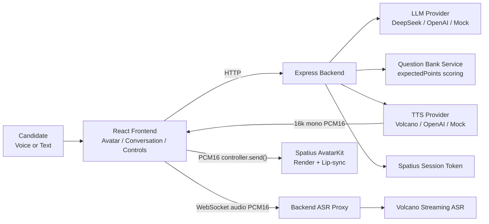

# AvaCoach

AvaCoach 是一个中文 IT 数字人模拟面试训练系统 Demo。它把数字人渲染、口型同步、中文语音合成、实时语音识别、LLM 面试官、结构化题库评分和最终报告串成一条完整闭环，用于展示“像被真人面试官提问一样”的技术面试训练体验。

当前项目是可运行的 demo/prototype，不宣称为生产级系统。工程重点是完整链路、稳定 fallback、后端密钥隔离、面试状态保护和可演示的用户体验。

---

## Quick Start（克隆后 5 分钟跑起来）

如果你刚 clone 这个仓库，按以下步骤操作：

```bash
# 1. 安装依赖
npm install

# 2. 配置环境变量（二选一）

## 选项 A：Safe Fallback Mode（无需任何 API Key，推荐面试官首次试用）
cp server/.env.example server/.env
cp client/.env.example client/.env
# 然后编辑 server/.env，确认以下两行：
#   LLM_PROVIDER=mock
#   TTS_PROVIDER=mock
#   ASR_PROVIDER=mock

## 选项 B：Full Demo Mode（需要配置真实 API Key，见下方环境变量章节）

# 3. 启动开发服务器
npm run dev

# 4. 打开浏览器
#    Frontend: http://localhost:5173
#    Backend:  http://localhost:3001
#    Health:   http://localhost:3001/health

# 5. 运行冒烟测试（可选，验证核心面试流程）
node scripts/smoke-demo-flow.mjs
```

> **说明**：Safe Fallback Mode 不需要任何外部 API Key。Avatar 区会显示 placeholder，语音使用浏览器内置 TTS，面试官用 mock LLM，题库评分和报告正常可用。完整效果见下方 "Full Demo vs Safe Fallback" 章节。

## Demo Highlights

- **Digital Human Interviewer**：Spatius AvatarKit Direct Mode 加载真实数字人。
- **Avatar Lip-sync**：Volcano TTS 输出 16kHz / mono / PCM16，通过 AvatarKit `controller.send()` 驱动口型同步。
- **Volcano TTS**：接入火山 TTS V3 HTTP Chunked，面试官中文播报可驱动数字人。
- **Volcano Streaming ASR**：浏览器麦克风采集 PCM16 / 16kHz / mono，经后端 WebSocket proxy 连接火山 Streaming ASR，partial / final transcript 实时回填。
- **Chinese IT Question Bank**：约 110 道结构化中文题，覆盖 Frontend / Backend / AI / Behavioral。
- **LLM Interviewer**：支持 DeepSeek / OpenAI / Mock provider，生成开场、追问、反馈和最终报告。
- **Server-side Interview State Machine**：后端 session 状态是权威状态，避免结束后继续追问。
- **0-100 Scoring with Expected Points**：题库模式结合 expectedPoints 覆盖率校准分数，并返回 coveredPoints / missingPoints / improvementTips / scoringReason。
- **Final Report**：输出综合评分、强项、薄弱项、推荐练习方向和题库知识点分析。
- **Robust Fallback**：Avatar / TTS / ASR / LLM / Spatius token 都有独立降级路径。

## Architecture



Repository:

- `client/`：React + Vite + TypeScript 前端工作台。
- `server/`：Node.js + Express + TypeScript 后端 API、provider 与状态机。
- `docs/`：交付说明、集成文档、演示脚本和架构说明。

安全边界：

- API Key 只放在 `server/.env`。
- 前端只使用公开的 `VITE_SPATIUS_APP_ID` / `VITE_SPATIUS_AVATAR_ID` 和后端签发的短期 Session Token。
- `.env` 文件不提交到 git。

## Core User Flow

1. Connect Avatar。
2. 选择 role / question source / difficulty / topic。
3. Start Interview。
4. 数字人面试官提出问题并口型同步播报。
5. 候选人用语音或文字回答。
6. ASR transcript 自动进入回答框，候选人可手动修改。
7. Submit Answer。
8. LLM 给出反馈和一个自然追问；题库模式同时展示 expectedPoints 覆盖情况。
9. 重复到最大轮次。
10. End Interview。
11. 查看 Final Report。

## Full Demo vs Safe Fallback Mode

AvaCoach 支持两种运行模式，取决于你是否有外部服务的 API Key 和额度。

### Full Demo Mode（完整数字人效果）

需要准备以下外部服务：

| 服务 | 需要什么 | 用途 |
|------|----------|------|
| **Spatius** | API Key + App ID + Avatar ID + 可用额度 + 正确 region | 加载真实数字人 Avatar，渲染和口型同步 |
| **Volcano TTS** | API Key + Resource ID + Voice Type + TTS 权限额度 | 数字人面试官中文语音播报 |
| **Volcano Streaming ASR** | API Key + Resource ID + Streaming ASR 权限额度 | 候选人语音回答实时识别 |
| **LLM (DeepSeek 或 OpenAI)** | API Key | 生成面试问题、反馈和报告（也可用 mock） |

配置好所有 Key 后，你可以体验到：

- ✅ 真实数字人渲染和口型同步
- ✅ 面试官中文 TTS 语音播报驱动 Avatar 嘴型
- ✅ 候选人语音回答 + 实时 transcript 回填
- ✅ LLM 生成自然追问和综合评价
- ✅ 题库评分 + 最终报告

### Safe Fallback Mode（无 Key / 无额度也能跑）

**不需要任何外部 API Key。** 推荐配置：

```bash
# server/.env — Safe Fallback Mode
PORT=3001
CLIENT_ORIGIN=http://localhost:5173

LLM_PROVIDER=mock
TTS_PROVIDER=mock
ASR_PROVIDER=mock

# 以下 Key 全部留空或设为 false
SPATIUS_API_KEY=
SPATIUS_APP_ID=
VOLCANO_TTS_ENABLED=false
VOLCANO_ASR_ENABLED=false
```

在这种模式下：

| 组件 | Fallback 行为 | 是否影响面试流程 |
|------|--------------|:--:|
| Avatar | 显示 placeholder / text mode | 否 |
| TTS | 浏览器内置 SpeechSynthesis 或静默文本模式 | 否 |
| ASR | 浏览器 Web Speech API 或手动输入 | 否 |
| LLM | Mock provider（预设中文反馈和评分） | 否 |
| 题库 | 约 110 道中文 IT 题，完全离线可用 | 否 |
| 评分 | expectedPoints 覆盖率计算，完全离线 | 否 |
| 报告 | 基于回答和题库的结构化报告 | 否 |

> **核心面试流程（选题 → 问答 → 评分 → 报告）不依赖任何外部服务。** 即使所有外部 provider 不可用，你仍然可以完整演示文字面试 + 题库评分 + 最终报告。

## Interview Flow & State Control

最新修复后，面试流程由后端 session 状态机统一控制：

- 后端维护轻量内存 session。
- 服务端 session status 是权威状态，前端传来的 status 只作为辅助信息。
- `/api/interview/next` 不再只相信前端传来的 status。
- `/api/interview/report` 生成报告后，服务端标记 session 为 `ended`。
- `status / nextAllowed / reportReady / shouldEnd` 由同一套规则派生。
- 三轮后返回 `status: "ended"`、`nextAllowed: false`、`reportReady: true`，前端引导点击 End Interview。
- ended 后再次提交不会继续生成追问。
- report 后只允许查看报告或 Reset Demo。
- 不再出现“面试官说已经结束，但系统又继续问下一题”的冲突。

题库追问逻辑也已收敛：

- 题库模式不再把 LLM 回复和 bank followUp 机械拼接。
- 每轮最多一个主问题。
- 未结束时：本轮反馈 + 一个自然追问。
- 结束时：收尾反馈 + 查看报告提示，不再生成新题。
- 候选人问薪资/福利/流程时，Ava 会简短回应并拉回技术面试。
- 候选人说不会、忘记了或要求换题时，Ava 会温和降难度或换相关角度，不会强行结束。

## Scoring Logic

评分统一为 `0-100`，避免出现 `8 / 100` 这种量纲错误。

题库模式会结合：

- LLM 基础评价。
- expectedPoints 覆盖率。
- coveredPoints。
- missingPoints。
- improvementTips。
- 回答长度、结构和具体项目/数据证据。

反馈结构包含：

- `score`
- `coveredPoints`
- `missingPoints`
- `improvementTips`
- `scoringReason`

`scoringReason` 用于解释为什么给这个分数，例如覆盖了多少期望要点、是否有具体数据或是否回答过短。覆盖率会反向校准分数：完整覆盖且有项目证据的回答会得到更合理的高分；只说“不会”的回答会被温和降难度，但分数会受限制。

## Tech Stack

Frontend:

- React + TypeScript + Vite
- Spatius AvatarKit Web SDK
- Web Audio API
- WebSocket streaming ASR client

Backend:

- Node.js + Express + TypeScript
- Provider-based LLM / TTS / ASR
- Server-side interview session state machine
- Question bank service

External services:

- Spatius AvatarKit Direct Mode
- Volcano TTS V3 HTTP Chunked
- Volcano Streaming ASR
- DeepSeek / OpenAI

## Local Setup

```bash
npm install
npm run dev
npm run build
```

- Frontend: `http://localhost:5173`
- Backend: `http://localhost:3001`
- Health check: `http://localhost:3001/health`

## Environment Variables

> ⚠️ **所有 Key 占位符必须为空，不要提交真实值。** `.env` 文件已在 `.gitignore` 中排除。

### server/.env（后端，按类别）

**1. 基础配置**

```bash
PORT=3001
CLIENT_ORIGIN=http://localhost:5173
```

**2. LLM 配置**

```bash
# 可选值: deepseek | openai | mock
LLM_PROVIDER=mock

# DeepSeek（当 LLM_PROVIDER=deepseek 时需要）
DEEPSEEK_API_KEY=
DEEPSEEK_MODEL=deepseek-v4-flash

# OpenAI（当 LLM_PROVIDER=openai 时需要）
OPENAI_API_KEY=
OPENAI_MODEL=gpt-4o-mini
```

**3. Spatius 数字人配置（Full Demo 需要）**

```bash
SPATIUS_API_KEY=
SPATIUS_APP_ID=
SPATIUS_REGION=us-west                   # us-west 或 ap-northeast
SPATIUS_TOKEN_EXPIRE_MINUTES=30
SPATIUS_INCLUDE_APP_ID_IN_TOKEN_REQUEST=false
```

**4. TTS 语音合成配置**

```bash
# 可选值: volcano | openai | mock
TTS_PROVIDER=mock

# Volcano TTS（当 TTS_PROVIDER=volcano 时需要）
VOLCANO_TTS_ENABLED=false
VOLCANO_TTS_API_KEY=
VOLCANO_ACCESS_KEY_ID=
VOLCANO_SECRET_ACCESS_KEY=
VOLCANO_APP_ID=
VOLCANO_TTS_RESOURCE_ID=seed-tts-2.0
VOLCANO_TTS_VOICE_TYPE=zh_female_vv_uranus_bigtts
VOLCANO_TTS_ENDPOINT=https://openspeech.bytedance.com/api/v3/tts/unidirectional
VOLCANO_TTS_FORMAT=pcm
VOLCANO_TTS_SAMPLE_RATE=16000
VOLCANO_TTS_SPEECH_RATE=0
VOLCANO_TTS_DISABLE_MARKDOWN_FILTER=true

# OpenAI TTS（当 TTS_PROVIDER=openai 时需要）
TTS_MODEL=gpt-4o-mini-tts
TTS_VOICE=alloy
```

**5. ASR 语音识别配置**

```bash
# 可选值: volcano_stream | browser | mock
ASR_PROVIDER=mock

# Volcano Streaming ASR（当 ASR_PROVIDER=volcano_stream 时需要）
VOLCANO_ASR_ENABLED=false
ASR_STREAM_DEBUG=false
VOLCANO_ASR_API_KEY=
VOLCANO_ASR_APP_ID=
VOLCANO_ASR_ACCESS_TOKEN=
VOLCANO_ASR_RESOURCE_ID=volc.seedasr.sauc.duration
VOLCANO_ASR_ENDPOINT=wss://openspeech.bytedance.com/api/v3/sauc/bigmodel_async
VOLCANO_ASR_LANGUAGE=zh-CN
VOLCANO_ASR_AUDIO_FORMAT=pcm
VOLCANO_ASR_SAMPLE_RATE=16000
VOLCANO_ASR_MODEL_NAME=bigmodel
```

### client/.env（前端公开变量）

```bash
# Spatius AvatarKit 公开 ID（Full Demo 需要）
VITE_SPATIUS_APP_ID=
VITE_SPATIUS_AVATAR_ID=
```

> **安全边界**：
> - API Key 只能放 `server/.env`，前端不接触任何密钥。
> - `client/.env` 只放 Vite 公开变量（`VITE_*` 前缀会自动暴露给浏览器）。
> - `.env.example` 文件（`server/.env.example`、`client/.env.example`）已提供完整模板，所有 Key 均为空占位符。
> - 不要把真实 key、sessionToken、Avatar ID 写进 README、docs 或代码注释。

## Smoke Test

项目提供了 `scripts/smoke-demo-flow.mjs`，用于验证核心面试流程是否正常。

**特点**：

- 不依赖真实 Spatius Avatar
- 不依赖真实 Volcano TTS / ASR
- 不依赖真实 LLM API Key（使用题库 + mock 路径）
- 不读取任何 `.env` 或 API Key
- 只验证 interview start / next / change question / salary / ended / report
- 输出 PASS / FAIL

**运行方式**：

```bash
# 先启动后端（另一个终端）
npm run dev --workspace server

# 运行冒烟测试
node scripts/smoke-demo-flow.mjs

# 可选：指定后端地址
node scripts/smoke-demo-flow.mjs --url http://localhost:3001
```

**预期输出**：44 项测试全部 PASS，0 FAIL。

> 建议 clone 后先跑一遍 smoke test，确认核心面试通路正常，再根据需要配置外部服务跑完整效果。

## Demo Script

1. 打开页面，介绍 AvaCoach 是中文 IT 数字人模拟面试系统。
2. 点击 Connect Avatar，展示真实数字人加载。
3. 选择 IT 题库 / Frontend / React / 中等。
4. 点击 Start Interview，数字人用中文提问并口型同步。
5. 点击开始语音回答，展示 Volcano Streaming ASR partial / final transcript。
6. 检查识别文本进入回答框，候选人可手动修改。
7. 点击 Submit Answer，右侧展示 score、coveredPoints、missingPoints、improvementTips 和 scoringReason。
8. 第二轮可演示“我不会，可以换一道吗？”，Ava 会自然换题，不会结束面试。
9. 演示完整回答时，评分会根据 expectedPoints 覆盖度合理上调。
10. 三轮后系统提示生成报告。
11. 点击 End Interview，展示 Final Report。
12. 说明 ended 后不会继续生成新问题，只能查看报告或 Reset Demo。

## Fallback Strategy

Fallback 是 demo 稳定性的设计，不是异常状态。

| Layer | Fallback |
| --- | --- |
| Spatius token failed | Fallback demo remains usable |
| AvatarKit failed | Placeholder / text mode |
| TTS failed | Browser speech / silent text mode |
| ASR failed | Browser speech recognition / manual input |
| LLM failed | Mock provider |
| Question bank filter missed | Same-role fallback question |

核心面试流程不依赖任何单一外部 provider，确保演示现场稳定。

## Interviewer Quick Checklist

Clone 仓库后，按此清单逐项验证：

- [ ] `npm install` 成功（无报错）
- [ ] `server/.env` 已配置（Safe Fallback 或 Full Demo）
- [ ] `client/.env` 已配置（placeholder 或真实 Avatar ID）
- [ ] `npm run dev` 两个服务都正常启动
- [ ] `http://localhost:5173` 页面可打开，三栏布局正常
- [ ] `http://localhost:3001/health` 返回 `{"ok":true}`
- [ ] `node scripts/smoke-demo-flow.mjs` 全部 PASS
- [ ] Start Interview 可生成题目（mock 或 LLM）
- [ ] Submit Answer 可生成 feedback（score / coveredPoints / missingPoints / improvementTips / scoringReason）
- [ ] "我不会，可以换一道吗？" → 换题不结束
- [ ] "我们能不能先聊薪资？" → 拉回技术不结束
- [ ] 三轮后显示 ended / nextAllowed=false / reportReady=true
- [ ] End Interview → Final Report 正常展示
- [ ] Reset Demo → 状态完全清空，可重新开始
- [ ] 没有真实 API Key、sessionToken 或 Avatar ID 被提交到 git
- [ ] `npm run build` 通过（仅 AvatarKit WASM / chunk size warning 可忽略）

## Current Status

已完成：

- React + Express monorepo。
- 三栏 SaaS 工作台 UI。
- Spatius AvatarKit Direct Mode。
- 后端安全签发 Session Token。
- 真实 Avatar 加载、sample PCM 验证和 TTS PCM 驱动 lip-sync。
- Volcano TTS 16kHz / mono / PCM16。
- Volcano Streaming ASR partial / final transcript。
- DeepSeek / OpenAI / Mock LLM providers。
- 中文 IT 题库约 110 道。
- expectedPoints-based scoring。
- Server-side interview state machine。
- 面试流程结束保护。
- 最终报告。
- Avatar / TTS / ASR / LLM fallback。

待完成或可继续增强：

- Production deployment。
- 用户账号和历史记录。
- 报告 PDF 真实导出。
- 企业 JD 定向题库。
- 更多 Avatar 形象选择。
- 更细粒度评分维度和训练计划。

## Known Warnings

- **AvatarKit WASM / chunk size warning** — 已知非阻塞 warning。AvatarKit SDK 的 WASM 文件较大（约 1.3MB），构建时会触发 chunk size 提示。不影响功能，`npm run build` 通过即可接受。
- **Avatar 连接失败** — 如果点击 Connect Avatar 后显示 error / not_configured / token_fallback，优先检查：
  1. Spatius 账户额度是否充足
  2. `server/.env` 中 `SPATIUS_API_KEY` 和 `SPATIUS_APP_ID` 是否正确
  3. `client/.env` 中 `VITE_SPATIUS_APP_ID` 和 `VITE_SPATIUS_AVATAR_ID` 是否正确
  4. `SPATIUS_REGION` 是否与 Spatius 控制台中 Avatar 所在 region 一致
  5. 后端 `/api/spatius/session-token` 是否返回 `fallback: false`
- **TTS 返回 PCM 但听不到声音** — 检查浏览器是否允许自动播放（autoplay policy），以及 TTS PCM sample rate 是否为 16000。
- **ASR 录音无反应** — 检查浏览器是否授予麦克风权限，以及 `ASR_PROVIDER` 是否设为 `volcano_stream` 或 `browser`。

## References

- [Final Submission](docs/final-submission.md)
- [Demo Script](docs/demo-script.md)
- [Interview Pitch](docs/interview-pitch.md)
- [Provider Architecture](docs/provider-architecture.md)
- [Spatius Integration](docs/spatius-integration.md)
- [TTS Integration](docs/tts-integration.md)
- [ASR Plan](docs/asr-plan.md)
