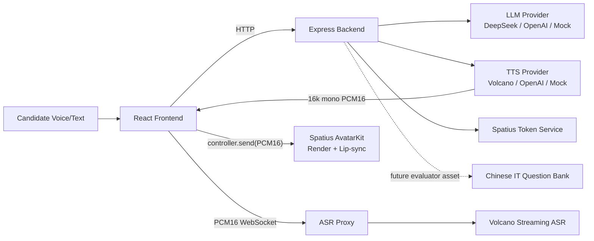

# AvaCoach

AvaCoach 是一个中文 AI 数字人模拟面试训练系统 Demo。它把数字人 Avatar、口型同步、中文 TTS、流式 ASR、LLM 面试官、结构化 IT 知识资产、实时反馈和最终报告串成完整闭环，用于展示“像真实面试官一样提问、倾听、追问和反馈”的产品体验。

当前项目是可运行的 demo/prototype，不宣称生产级系统。工程目标是：链路完整、密钥安全、provider 可替换、fallback 稳定、现场演示可靠。

## 当前核心策略

AvaCoach 主演示流程已经调整为 **AI 动态面试**：

- 用户选择岗位和 Topic，例如 `HTTP / Network`、`Vector Database`、`React`。
- LLM 根据岗位和 Topic 生成第一题。
- 后续轮次由 LLM 根据候选人真实回答决定：深入追问、换角度、降低难度或收束。
- 右侧反馈展示综合评价、评分依据、改进建议和最终报告。
- 不再在主演示路径中展示机械的 `coveredPoints / missingPoints` 判卷面板。

题库没有删除。`server/src/data/interviewQuestionBank.json` 仍然保留为结构化中文 IT 知识资产，包含约 110 道题及 expectedPoints / followUps / tags。它当前定位为：

- 首题和 Topic 设计的参考素材。
- 后续离线评测、题库训练、企业 JD 定制题库的基础数据。
- 未来可插拔的 rubric/evaluator 层，而不是当前 demo 的强制判卷 UI。

这样做的原因是：现场演示更需要自然的面试节奏，而不是每轮机械套题库要点。题库作为底层资产保留，可以证明项目有结构化知识沉淀，也为后续严肃评测留下扩展空间。

## Demo Highlights

- **Spatius AvatarKit Direct Mode**：真实数字人 Avatar 渲染和口型同步。
- **Backend Session Token**：Spatius API Key 只保存在后端，前端只拿短期 session token。
- **Volcano TTS**：火山 TTS V3 HTTP Chunked 返回 16kHz / mono / PCM16 音频。
- **Avatar Lip-sync**：前端把 TTS PCM 送入 AvatarKit `controller.send()` 驱动嘴型。
- **Volcano Streaming ASR**：候选人语音回答实时转写，partial / final transcript 回填回答框。
- **LLM Interviewer**：支持 DeepSeek / OpenAI / Mock provider，生成问题、追问、反馈和报告。
- **Dynamic Interview Flow**：Topic 引导，LLM 临场判断，不机械套固定 followUp。
- **Structured Question Bank Asset**：约 110 道中文 IT 题作为知识资产保留。
- **Fallback Design**：Avatar、TTS、ASR、LLM、Spatius token 都有降级路径。
- **Three-column SaaS UI**：配置、数字人对话、反馈报告分区稳定展示。

## Architecture



安全边界：

- 所有 API Key 只放在 `server/.env`。
- `client/.env` 只放 `VITE_SPATIUS_APP_ID` 和 `VITE_SPATIUS_AVATAR_ID` 这类前端公开变量。
- 前端不接触 `SPATIUS_API_KEY`、`VOLCANO_TTS_API_KEY`、`VOLCANO_ASR_API_KEY`、LLM API Key。
- `.env` 文件不提交到 git。

## Quick Start

```bash
npm install
npm run dev
```

- Frontend: `http://localhost:5173`
- Backend: `http://localhost:3001`
- Health: `http://localhost:3001/health`

构建：

```bash
npm run build
```

已知非阻塞 warning：AvatarKit WASM / chunk size warning。只要 `npm run build` 通过即可。

## Environment

### Safe Fallback Mode

无需外部 key，即可跑通文字面试、mock LLM、fallback 语音和报告。

```bash
LLM_PROVIDER=mock
TTS_PROVIDER=mock
ASR_PROVIDER=mock
VOLCANO_TTS_ENABLED=false
VOLCANO_ASR_ENABLED=false
SPATIUS_API_KEY=
```

### Full Demo Mode

需要在 `server/.env` 配置：

```bash
LLM_PROVIDER=deepseek      # or openai / mock
DEEPSEEK_API_KEY=
OPENAI_API_KEY=

SPATIUS_API_KEY=
SPATIUS_APP_ID=
SPATIUS_REGION=us-west
SPATIUS_TOKEN_EXPIRE_MINUTES=30

TTS_PROVIDER=volcano
VOLCANO_TTS_ENABLED=true
VOLCANO_TTS_API_KEY=
VOLCANO_TTS_RESOURCE_ID=
VOLCANO_TTS_VOICE_TYPE=
VOLCANO_TTS_ENDPOINT=https://openspeech.bytedance.com/api/v3/tts/unidirectional
VOLCANO_TTS_FORMAT=pcm
VOLCANO_TTS_SAMPLE_RATE=16000

ASR_PROVIDER=volcano_stream
VOLCANO_ASR_ENABLED=true
VOLCANO_ASR_API_KEY=
VOLCANO_ASR_RESOURCE_ID=
VOLCANO_ASR_ENDPOINT=
VOLCANO_ASR_LANGUAGE=zh-CN
```

需要在 `client/.env` 配置：

```bash
VITE_SPATIUS_APP_ID=
VITE_SPATIUS_AVATAR_ID=
```

更换数字人形象时，只需要修改 `client/.env` 的 `VITE_SPATIUS_AVATAR_ID`，然后重启 `npm run dev`。

## Core Demo Flow

1. 打开页面。
2. 点击 `Connect Avatar`。
3. 选择岗位和 Topic。
4. 点击 `Start Interview`。
5. 数字人用中文提问，并通过 Volcano TTS + AvatarKit 驱动口型。
6. 候选人语音或文字回答。
7. ASR transcript 自动回填，候选人可手动编辑。
8. 点击 `Submit Answer`。
9. LLM 根据回答生成自然反馈、评分依据、改进建议和下一步追问。
10. 三轮左右后点击 `End Interview`。
11. 查看 Final Report。

## Fallback Philosophy

Fallback 是演示稳定性的设计，不是功能缺陷：

- Spatius token 失败：使用 Avatar placeholder，面试继续。
- AvatarKit 失败：文字面试和反馈继续。
- TTS 失败：Browser Speech 或 Silent Text。
- ASR 失败：Browser ASR 或手动输入。
- LLM 失败：Mock provider。

核心原则：任何单一外部 provider 不可用时，AvaCoach 仍能展示完整面试闭环。

## Current Status

已完成：

- React + Express monorepo。
- 三栏 SaaS 工作台 UI。
- Spatius AvatarKit Direct Mode。
- 后端 Session Token。
- 真实 Avatar 连接与 lip-sync。
- Volcano TTS PCM 链路。
- Volcano Streaming ASR。
- DeepSeek / OpenAI / Mock LLM providers。
- AI 动态面试主流程。
- 中文 IT 题库资产保留。
- 最终报告。
- 多层 fallback。

待增强：

- 将题库升级为可配置 evaluator/rubric 层。
- 企业 JD 定制题库。
- 报告 PDF 导出。
- 用户账号、历史记录和生产部署。
- 更细粒度的面试轮次规划与训练计划。

## Useful Docs

- [Demo Script](docs/demo-script.md)
- [Demo Strategy](docs/demo-strategy.md)
- [Final Submission](docs/final-submission.md)
- [Provider Architecture](docs/provider-architecture.md)
- [Spatius Integration](docs/spatius-integration.md)
- [TTS Integration](docs/tts-integration.md)
- [ASR Plan](docs/asr-plan.md)
