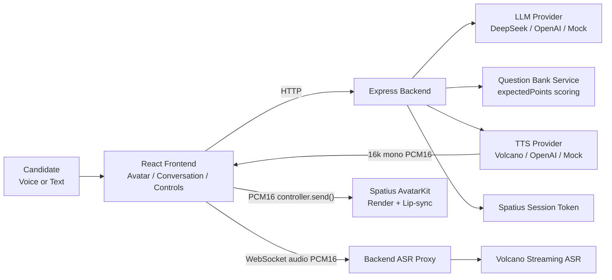

# AvaCoach

AvaCoach 是一个中文 IT 数字人模拟面试训练系统 Demo。它把数字人渲染、口型同步、中文语音合成、实时语音识别、LLM 面试官、结构化题库评分和最终报告串成一条完整闭环，用于展示“像被真人面试官提问一样”的技术面试训练体验。

当前项目是可运行的 demo/prototype，不宣称为生产级系统。工程重点是完整链路、稳定 fallback、后端密钥隔离、面试状态保护和可演示的用户体验。

## Demo Highlights

- **Digital Human Interviewer**：Spatius AvatarKit Direct Mode 加载真实数字人。
- **Avatar Lip-sync**：Volcano TTS 输出 16kHz / mono / PCM16，通过 AvatarKit `controller.send()` 驱动口型同步。
- **Volcano TTS**：接入火山 TTS V3 HTTP Chunked，面试官中文播报可驱动数字人。
- **Volcano Streaming ASR**：浏览器麦克风采集 PCM16 / 16kHz / mono，经后端 WebSocket proxy 连接火山 Streaming ASR，partial / final transcript 实时回填。
- **Chinese IT Question Bank**：约 110 道结构化中文题，覆盖 Frontend / Backend / AI / Behavioral。
- **LLM Interviewer**：支持 DeepSeek / OpenAI / Mock provider，生成开场、追问、反馈和最终报告。
- **Server-side Interview State Machine**：后端 session 状态是权威状态，避免结束后继续追问。
- **0-100 Scoring with Expected Points**：题库模式结合 expectedPoints 覆盖率校准分数，并返回 coveredPoints / missingPoints / improvementTips / scoringReason。
- **Final Report**：输出综合评分、强项、薄弱项、推荐练习方向和题库知识点分析。
- **Robust Fallback**：Avatar / TTS / ASR / LLM / Spatius token 都有独立降级路径。

## Architecture



Repository:

- `client/`：React + Vite + TypeScript 前端工作台。
- `server/`：Node.js + Express + TypeScript 后端 API、provider 与状态机。
- `docs/`：交付说明、集成文档、演示脚本和架构说明。

安全边界：

- API Key 只放在 `server/.env`。
- 前端只使用公开的 `VITE_SPATIUS_APP_ID` / `VITE_SPATIUS_AVATAR_ID` 和后端签发的短期 Session Token。
- `.env` 文件不提交到 git。

## Core User Flow

1. Connect Avatar。
2. 选择 role / question source / difficulty / topic。
3. Start Interview。
4. 数字人面试官提出问题并口型同步播报。
5. 候选人用语音或文字回答。
6. ASR transcript 自动进入回答框，候选人可手动修改。
7. Submit Answer。
8. LLM 给出反馈和一个自然追问；题库模式同时展示 expectedPoints 覆盖情况。
9. 重复到最大轮次。
10. End Interview。
11. 查看 Final Report。

## Interview Flow & State Control

最新修复后，面试流程由后端 session 状态机统一控制：

- 后端维护轻量内存 session。
- 服务端 session status 是权威状态，前端传来的 status 只作为辅助信息。
- `/api/interview/next` 不再只相信前端传来的 status。
- `/api/interview/report` 生成报告后，服务端标记 session 为 `ended`。
- `status / nextAllowed / reportReady / shouldEnd` 由同一套规则派生。
- 三轮后返回 `status: "ended"`、`nextAllowed: false`、`reportReady: true`，前端引导点击 End Interview。
- ended 后再次提交不会继续生成追问。
- report 后只允许查看报告或 Reset Demo。
- 不再出现“面试官说已经结束，但系统又继续问下一题”的冲突。

题库追问逻辑也已收敛：

- 题库模式不再把 LLM 回复和 bank followUp 机械拼接。
- 每轮最多一个主问题。
- 未结束时：本轮反馈 + 一个自然追问。
- 结束时：收尾反馈 + 查看报告提示，不再生成新题。
- 候选人问薪资/福利/流程时，Ava 会简短回应并拉回技术面试。
- 候选人说不会、忘记了或要求换题时，Ava 会温和降难度或换相关角度，不会强行结束。

## Scoring Logic

评分统一为 `0-100`，避免出现 `8 / 100` 这种量纲错误。

题库模式会结合：

- LLM 基础评价。
- expectedPoints 覆盖率。
- coveredPoints。
- missingPoints。
- improvementTips。
- 回答长度、结构和具体项目/数据证据。

反馈结构包含：

- `score`
- `coveredPoints`
- `missingPoints`
- `improvementTips`
- `scoringReason`

`scoringReason` 用于解释为什么给这个分数，例如覆盖了多少期望要点、是否有具体数据或是否回答过短。覆盖率会反向校准分数：完整覆盖且有项目证据的回答会得到更合理的高分；只说“不会”的回答会被温和降难度，但分数会受限制。

## Tech Stack

Frontend:

- React + TypeScript + Vite
- Spatius AvatarKit Web SDK
- Web Audio API
- WebSocket streaming ASR client

Backend:

- Node.js + Express + TypeScript
- Provider-based LLM / TTS / ASR
- Server-side interview session state machine
- Question bank service

External services:

- Spatius AvatarKit Direct Mode
- Volcano TTS V3 HTTP Chunked
- Volcano Streaming ASR
- DeepSeek / OpenAI

## Local Setup

```bash
npm install
npm run dev
npm run build
```

- Frontend: `http://localhost:5173`
- Backend: `http://localhost:3001`
- Health check: `http://localhost:3001/health`

## Environment Variables

只写占位符，不要写真实 key。

`server/.env`:

```bash
PORT=3001
CLIENT_ORIGIN=http://localhost:5173

LLM_PROVIDER=deepseek
OPENAI_API_KEY=
OPENAI_MODEL=gpt-4o-mini
DEEPSEEK_API_KEY=
DEEPSEEK_MODEL=deepseek-v4-flash

TTS_PROVIDER=volcano
VOLCANO_TTS_ENABLED=true
VOLCANO_TTS_API_KEY=
VOLCANO_TTS_RESOURCE_ID=
VOLCANO_TTS_VOICE_TYPE=
VOLCANO_TTS_FORMAT=pcm
VOLCANO_TTS_SAMPLE_RATE=16000

ASR_PROVIDER=volcano_stream
VOLCANO_ASR_ENABLED=true
VOLCANO_ASR_API_KEY=
VOLCANO_ASR_RESOURCE_ID=
VOLCANO_ASR_ENDPOINT=
VOLCANO_ASR_LANGUAGE=zh-CN

SPATIUS_API_KEY=
SPATIUS_APP_ID=
SPATIUS_REGION=us-west
SPATIUS_TOKEN_EXPIRE_MINUTES=30
```

`client/.env`:

```bash
VITE_SPATIUS_APP_ID=
VITE_SPATIUS_AVATAR_ID=
```

安全要求：

- API Key 只放 `server/.env`。
- `client/.env` 只放 Vite 公开变量，例如 Avatar ID 和 App ID。
- 不要把真实 key、sessionToken、Avatar ID 写进 README 或 docs。
- `.env` 不提交。

## Demo Script

1. 打开页面，介绍 AvaCoach 是中文 IT 数字人模拟面试系统。
2. 点击 Connect Avatar，展示真实数字人加载。
3. 选择 IT 题库 / Frontend / React / 中等。
4. 点击 Start Interview，数字人用中文提问并口型同步。
5. 点击开始语音回答，展示 Volcano Streaming ASR partial / final transcript。
6. 检查识别文本进入回答框，候选人可手动修改。
7. 点击 Submit Answer，右侧展示 score、coveredPoints、missingPoints、improvementTips 和 scoringReason。
8. 第二轮可演示“我不会，可以换一道吗？”，Ava 会自然换题，不会结束面试。
9. 演示完整回答时，评分会根据 expectedPoints 覆盖度合理上调。
10. 三轮后系统提示生成报告。
11. 点击 End Interview，展示 Final Report。
12. 说明 ended 后不会继续生成新问题，只能查看报告或 Reset Demo。

## Fallback Strategy

Fallback 是 demo 稳定性的设计，不是异常状态。

| Layer | Fallback |
| --- | --- |
| Spatius token failed | Fallback demo remains usable |
| AvatarKit failed | Placeholder / text mode |
| TTS failed | Browser speech / silent text mode |
| ASR failed | Browser speech recognition / manual input |
| LLM failed | Mock provider |
| Question bank filter missed | Same-role fallback question |

核心面试流程不依赖任何单一外部 provider，确保演示现场稳定。

## Current Status

已完成：

- React + Express monorepo。
- 三栏 SaaS 工作台 UI。
- Spatius AvatarKit Direct Mode。
- 后端安全签发 Session Token。
- 真实 Avatar 加载、sample PCM 验证和 TTS PCM 驱动 lip-sync。
- Volcano TTS 16kHz / mono / PCM16。
- Volcano Streaming ASR partial / final transcript。
- DeepSeek / OpenAI / Mock LLM providers。
- 中文 IT 题库约 110 道。
- expectedPoints-based scoring。
- Server-side interview state machine。
- 面试流程结束保护。
- 最终报告。
- Avatar / TTS / ASR / LLM fallback。

待完成或可继续增强：

- Production deployment。
- 用户账号和历史记录。
- 报告 PDF 真实导出。
- 企业 JD 定向题库。
- 更多 Avatar 形象选择。
- 更细粒度评分维度和训练计划。

## Known Warnings

- AvatarKit WASM / chunk size warning 是已知非阻塞 warning。
- 当前 `npm run build` 通过；如果只出现 AvatarKit WASM 或 chunk size warning，可以接受。

## References

- [Final Submission](docs/final-submission.md)
- [Demo Script](docs/demo-script.md)
- [Interview Pitch](docs/interview-pitch.md)
- [Provider Architecture](docs/provider-architecture.md)
- [Spatius Integration](docs/spatius-integration.md)
- [TTS Integration](docs/tts-integration.md)
- [ASR Plan](docs/asr-plan.md)
