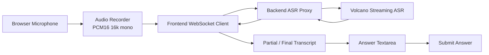

# ASR Integration

## Role in AvaCoach

ASR 是候选人语音回答输入层。它负责把候选人的语音回答转换成文字，填入回答框，再复用现有 Submit Answer 流程。ASR 不直接决定评分、不直接生成追问，也不影响 AvatarKit/TTS 链路。

## Current Status

已完成：

- Browser microphone capture。
- PCM16 / 16kHz / mono audio path。
- Backend WebSocket ASR proxy。
- Volcano Streaming ASR integration。
- partial transcript 实时显示。
- final transcript 回填回答框。
- 用户可手动编辑识别文本。
- Submit Answer 仍由用户确认触发。
- Browser ASR / manual input fallback。
- 安全 debug，不输出 API Key 或完整音频。

## Runtime Flow

## UX Rules

- 点击“开始语音回答”后请求麦克风权限。
- 点击“停止录音”后等待 final transcript。
- transcript 自动填入回答框。
- 用户仍可手动修改。
- 不自动提交。
- 数字人正在说话时建议禁用录音，避免收音干扰。
- 识别失败时保留文字输入。

## Fallback Strategy

- Volcano Streaming ASR 失败 -> Browser SpeechRecognition。
- Browser SpeechRecognition 不支持 -> Manual input。
- 麦克风权限被拒绝 -> Manual input。
- 没有检测到语音 -> Manual input 或重新录音。

Fallback 不影响现有 LLM、TTS、AvatarKit 或题库链路。

## Security Notes

- `VOLCANO_ASR_API_KEY` 只放在 `server/.env`。
- 前端不读取、不打印、不提交真实 key。
- 不把用户录音保存到仓库。
- Debug 只记录 attemptId、audioBytes、状态码、错误摘要等安全字段。

## Demo Talking Point

> 候选人可以用语音回答，但系统不会自动提交。ASR transcript 只是增强输入方式，最终仍由用户确认后 Submit Answer，保证面试流程可控。

## Current Limitations

- 当前是 demo/prototype，没有录音历史管理。
- 没有生产级隐私审计和数据留存策略。
- 火山 ASR provider 参数后续可根据正式账号配置继续细化。
