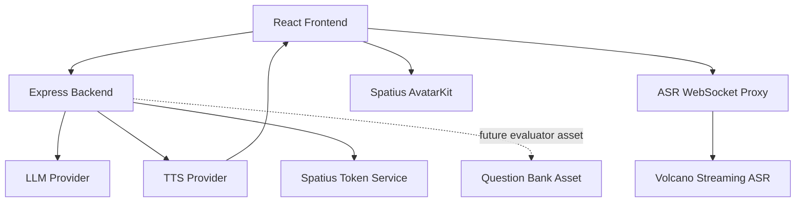

# Provider Architecture

AvaCoach uses a provider-based architecture. LLM, TTS, ASR, Spatius, and future evaluator logic are separated behind clear boundaries. This keeps the demo stable and makes each provider replaceable.

## High-level Flow

## LLM Provider

Responsibilities:

- Generate Topic-guided opening questions.
- Evaluate candidate answers.
- Decide whether to follow up, change angle, lower difficulty, or end.
- Generate natural interviewer replies.
- Generate user-friendly feedback, scoring reason, suggestions, and final report.

Providers:

- DeepSeek
- OpenAI
- Mock

Fallback:

- DeepSeek/OpenAI failure automatically falls back to Mock.
- Mock keeps the same response shape so the frontend remains stable.

## TTS Provider

Responsibilities:

- Convert interviewer reply text into playable audio.
- Prefer AvatarKit-compatible 16kHz / mono / PCM16.
- Keep text visible even when audio fails.

Providers:

- Volcano TTS V3 HTTP Chunked
- OpenAI TTS
- Mock / browser fallback

Avatar integration:

- Volcano TTS returns PCM16.
- The frontend sends PCM to AvatarKit `controller.send()`.
- Browser SpeechSynthesis is fallback only and does not drive lip-sync.

## ASR Provider

Responsibilities:

- Let the candidate answer by voice.
- Return partial and final transcript.
- Fill the answer textarea without auto-submitting.
- Preserve manual editing and manual Submit Answer.

Providers:

- Volcano Streaming ASR through backend WebSocket proxy.
- Browser SpeechRecognition fallback.
- Manual input fallback.

## Spatius Provider

Responsibilities:

- Backend mints Direct Mode Session Token.
- Frontend initializes AvatarKit.
- AvatarKit renders the real Avatar.
- AvatarKit receives PCM16 audio and drives lip-sync.

Security:

- `SPATIUS_API_KEY` exists only in `server/.env`.
- Frontend only uses public app/avatar IDs and backend-minted session token.

## Question Bank Asset

Current status:

- Retained in `server/src/data/interviewQuestionBank.json`.
- About 110 Chinese IT questions.
- Includes role, topic, difficulty, expectedPoints, followUps, tags, source, and sourceNote.
- Not exposed as the main demo mode.
- Not used to show covered/missing point lists in the current UI.

Why it remains:

- It proves structured domain preparation.
- It can seed future Topic plans.
- It can support offline regression tests.
- It can become a calibrated evaluator/rubric layer later.

This avoids two extremes: removing the bank would make the project look less rigorous; forcing it into every demo turn makes the interview feel mechanical.

## Interview State Machine

Responsibilities:

- Backend session state is authoritative.
- Derives `status / nextAllowed / reportReady / shouldEnd`.
- Prevents generating new questions after the interview ends.

States:

- `idle`
- `in_progress`
- `ended`

Rules:

- Start Interview -> `in_progress`.
- Submit Answer -> evaluate one turn.
- Max rounds -> `ended`, `nextAllowed=false`, `reportReady=true`.
- Report -> `ended`.
- Ended `/next` returns a no-op response.

## Provider Philosophy

Every provider can fail. The product should not collapse:

- LLM fallback keeps questions and feedback available.
- TTS fallback keeps text and optional browser voice available.
- ASR fallback keeps manual input available.
- Avatar fallback keeps the interview flow available.
- Question bank remains as a data asset, not a runtime dependency for the demo.
