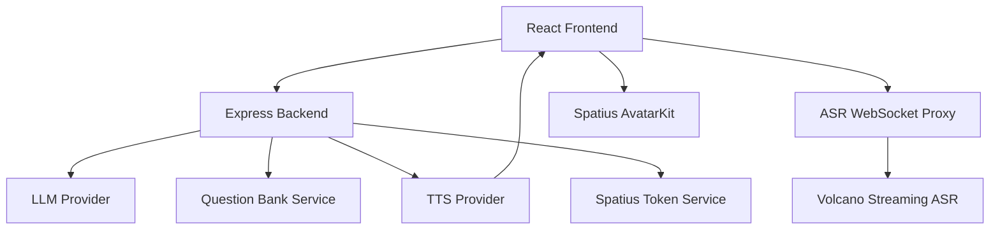

# Provider Architecture

AvaCoach 使用 provider-based 架构，把 LLM、TTS、ASR、Spatius 和题库评分拆成清晰边界。这样既方便面试演示，也方便后续替换供应商或扩展生产能力。

## High-level Flow

## LLM Provider

Responsibility:

- 生成开场和第一题。
- 根据候选人回答生成反馈和一个自然追问。
- 生成最终报告。
- 遇到薪资/福利/流程类问题时，简短回应并拉回技术面试。
- 候选人说不会或要求换题时，温和降难度或换相关问题。

Providers:

- DeepSeek
- OpenAI
- Mock

Fallback:

- DeepSeek/OpenAI 失败时自动切换 Mock provider。
- Mock provider 仍返回 0-100 score、feedback、suggestion 和状态字段。

## TTS Provider

Responsibility:

- 将 interviewer replyText 转换成可播放音频。
- 成功路径优先输出 AvatarKit 可用的 16kHz / mono / PCM16。

Providers:

- Volcano TTS V3 HTTP Chunked
- OpenAI TTS
- Mock / browser fallback

Avatar integration:

- Volcano TTS 返回 PCM16 时，前端直接送入 AvatarKit `controller.send()`。
- 如果返回的是非 PCM 音频，前端可转换为 16k mono PCM16 后再发送。
- Browser SpeechSynthesis 只做 fallback，不驱动 Avatar lip-sync。

Fallback:

- TTS 请求失败 -> browser speech。
- Browser speech 不可用 -> silent text mode。
- TTS 或 fallback 失败不影响文字面试流程。

## ASR Provider

Responsibility:

- 让候选人用语音回答。
- 将 partial / final transcript 回填到 answer textarea。
- 保留手动修改和手动提交权。

Providers:

- Volcano Streaming ASR via backend WebSocket proxy。
- Browser SpeechRecognition fallback。
- Manual input fallback。

Streaming flow:

1. 浏览器麦克风采集音频。
2. 前端转换/发送 PCM16 / 16kHz / mono。
3. 后端 ASR proxy 转发到 Volcano Streaming ASR。
4. 后端返回 partial / final transcript。
5. 前端将 transcript 写入回答框。

Fallback:

- Volcano ASR 失败 -> browser ASR。
- Browser ASR 不支持或被拒绝 -> manual input。

## Spatius Provider

Responsibility:

- 后端生成 Direct Mode Session Token。
- 前端初始化 AvatarKit。
- 加载真实 Avatar。
- 接收 PCM16 音频并驱动 lip-sync。

Security:

- `SPATIUS_API_KEY` 只存在 `server/.env`。
- 前端不接触 API Key。
- 前端只使用 `VITE_SPATIUS_APP_ID`、`VITE_SPATIUS_AVATAR_ID` 和后端返回的短期 Session Token。

Fallback:

- Token 失败 -> fallback demo still usable。
- SDK 初始化失败 -> placeholder mode。
- Avatar disconnected -> text interview remains usable。

## Question Bank Service

Responsibility:

- 管理中文 IT 结构化题库。
- 根据 role / difficulty / topic 选择题目。
- 提供 questionMeta：expectedPoints、followUps、tags。
- 评估回答覆盖了哪些 expectedPoints。
- 输出 coveredPoints、missingPoints、improvementTips。
- 用覆盖率校准 0-100 score。

Latest fix:

- 题库模式不再机械拼接 LLM 回复和 bank followUp。
- 每轮最多一个主问题。
- 未结束时生成反馈 + 一个自然追问。
- 结束时只生成收尾反馈和报告提示。

## Interview State Machine

Responsibility:

- 后端维护轻量 session。
- 统一派生 `status / nextAllowed / reportReady / shouldEnd`。
- 防止 ended 后继续生成追问。

States:

- `idle`
- `in_progress`
- `ended`

Rules:

- Start Interview -> `in_progress`。
- 每次 Submit Answer -> round + 1。
- 达到最大轮次 -> `ended`、`nextAllowed=false`、`reportReady=true`。
- End Interview/report -> `ended`。
- ended 后 `/next` 返回 no-op，不再调用新的追问逻辑。

## Fallback Provider Philosophy

每层 provider 都可以失败，但核心 demo 不应崩溃：

- LLM fallback 保证有问题和反馈。
- TTS fallback 保证文字和基础语音仍可展示。
- ASR fallback 保证手动输入仍可用。
- Avatar fallback 保证面试流程仍可用。
- Question bank fallback 保证能选择同 role 或 behavioral 题目。

这使 AvaCoach 适合现场面试演示：即使某个外部服务不可用，也能完整展示产品闭环。
